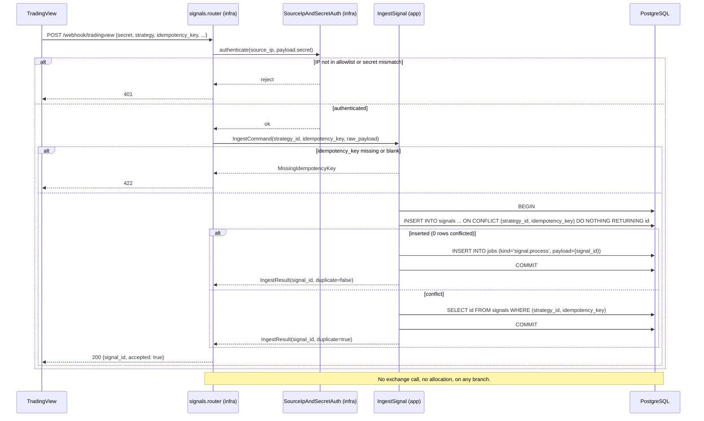
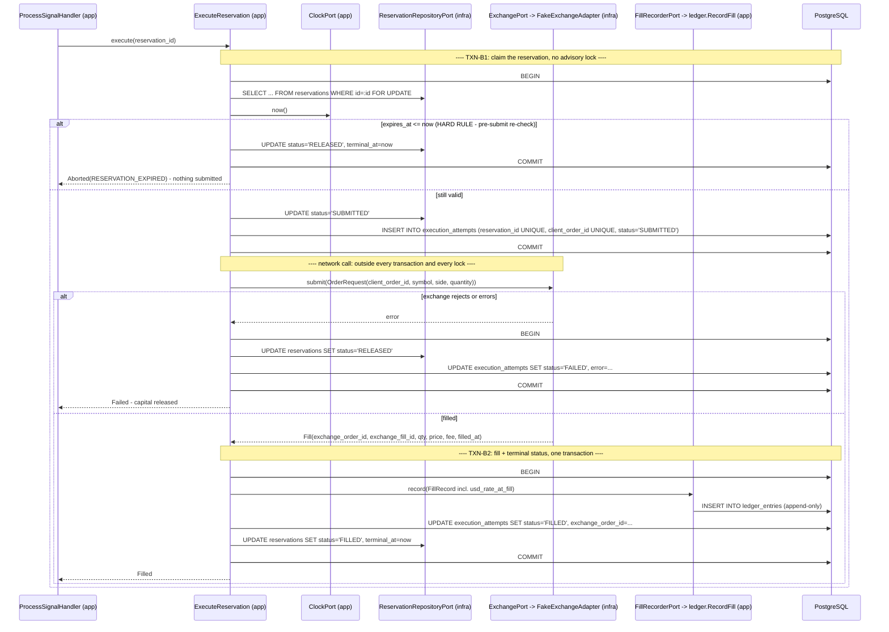
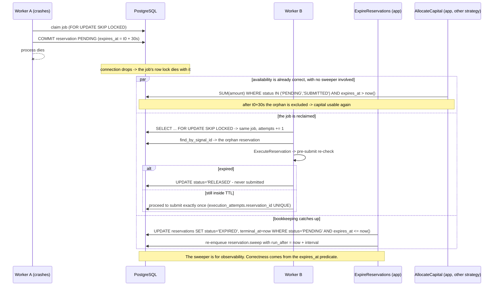

# Design: Allocation Engine

> Size note: the skill's 800-word design budget is deliberately exceeded. The
> launch brief requires the full SQL schema, four sequence diagrams, the decision
> algorithm and the concurrency test design in this artifact. Recorded as a risk.

## Technical Approach

Three processes over one PostgreSQL database:

1. **API process** (`main.py`) — mounts the signals router. Validates, persists,
   enqueues, returns 200. Never touches allocation or the exchange.
2. **Worker process** (`shared/infrastructure/worker_runner.py`) — claims jobs
   with `FOR UPDATE SKIP LOCKED` and runs one handler per job kind.
3. **Postgres** — queue, lock manager, and the enforcement point for
   idempotency (unique constraints) and append-only (triggers).

The money invariant lives in exactly one place: a short transaction that takes
`pg_advisory_xact_lock(hashtext(venue), hashtext(settlement_currency))`, reads
availability, decides, and writes the reservation. Everything slower than that —
policy reads, exchange round-trips, ledger writes, sweeping — is deliberately
outside it.

Cross-module wiring obeys the proposal's rule: **the consumer declares the port,
the provider owns the adapter, `main.py` binds them.** No `domain` module ever
imports another module's `domain`.

---

## Component Inventory

Layer is stated for every component. `domain` imports no FastAPI, SQLAlchemy,
httpx, pydantic-settings or `asyncio` primitives — only `dataclasses`, `enum`,
`decimal`, `datetime` and `typing`.

### `shared/` (slice 1)

| Component | Path | Layer |
|---|---|---|
| `Currency`, `Venue` (str enums), `Money` (frozen, `Decimal`) | `shared/domain/money.py` | domain |
| `DomainError`, `InvariantViolation` | `shared/domain/errors.py` | domain |
| `ClockPort`, `UsdRateProviderPort`, `JobQueuePort`, `UnitOfWorkPort` (Protocols) | `shared/application/ports.py` | application |
| `Job`, `JobKind`, `ClaimedJob` (DTOs) | `shared/application/job.py` | application |
| `SystemClock` | `shared/infrastructure/clock.py` | infrastructure |
| `FixedUsdRateProvider` | `shared/infrastructure/usd_rate.py` | infrastructure |
| `PostgresJobQueue` (`SKIP LOCKED` claim/ack/fail/retry) | `shared/infrastructure/job_queue.py` | infrastructure |
| `SqlAlchemyUnitOfWork` | `shared/infrastructure/unit_of_work.py` | infrastructure |
| `JobRow` | `shared/infrastructure/models.py` | infrastructure |
| `WorkerRunner` (claim loop, handler registry) | `shared/infrastructure/worker_runner.py` | infrastructure |
| `reservation_ttl_seconds`, `configured_pools`, `worker_poll_interval_seconds` | `shared/config.py` (modify) | infrastructure |

### `signals/` (slice 2)

| Component | Path | Layer |
|---|---|---|
| `WebhookSignal`, `IdempotencyKey` (VO), `SignalStatus` | `signals/domain/signal.py` | domain |
| `SignalRepositoryPort`, `WebhookAuthPort` | `signals/application/ports.py` | application |
| `IngestSignal` use case, `IngestCommand`/`IngestResult` | `signals/application/ingest_signal.py` | application |
| `SqlAlchemySignalRepository` (`ON CONFLICT DO NOTHING` + lookup) | `signals/infrastructure/repository.py` | infrastructure |
| `SignalRow` | `signals/infrastructure/models.py` | infrastructure |
| `SourceIpAndSecretAuth` | `signals/infrastructure/auth.py` | infrastructure |
| `router` (`POST /webhook/tradingview`) | `signals/infrastructure/router.py` | infrastructure |

### `strategies/` (slice 3)

| Component | Path | Layer |
|---|---|---|
| `Strategy`, `FillMode` (`SKIP`/`PARTIAL`), `AllocationPolicy` (VO) | `strategies/domain/strategy.py` | domain |
| `StrategyRepositoryPort` | `strategies/application/ports.py` | application |
| `StrategyPolicyAdapter` — implements `allocation.application.StrategyPolicyPort`, returns allocation's DTO | `strategies/application/policy_adapter.py` | application |
| `SqlAlchemyStrategyRepository`, `StrategyRow` | `strategies/infrastructure/` | infrastructure |

### `accounts/` (slice 3)

| Component | Path | Layer |
|---|---|---|
| `PoolConfig` (venue, currency, min_order_size, enabled) | `accounts/domain/pool_config.py` | domain |
| `BalanceSourcePort` | `accounts/application/ports.py` | application |
| `PoolBalanceAdapter` — implements `allocation.application.PoolBalancePort` | `accounts/application/pool_balance_adapter.py` | application |
| `CapitalPoolRepository` (reads the `capital_pools` table — the single source of truth; there is no `CONFIGURED_POOLS` env var), `CapitalPoolRow` | `accounts/infrastructure/` | infrastructure |
| `FakeBalanceSource` | `accounts/infrastructure/fake_balance_source.py` | infrastructure |

### `allocation/` (slices 4 and 6)

| Component | Path | Layer |
|---|---|---|
| `PoolKey` (VO: venue + currency) | `allocation/domain/pool_key.py` | domain |
| `LockKey` (VO: the ordered text pair handed to `hashtext`) | `allocation/domain/lock_key.py` | domain |
| `CapitalPool` (aggregate: key, balance, reserved_active, `available`) | `allocation/domain/capital_pool.py` | domain |
| `Reservation`, `ReservationStatus` | `allocation/domain/reservation.py` | domain |
| `AllocationRules` (VO: fill_mode, min_order_size) | `allocation/domain/rules.py` | domain |
| `AllocationDecision`, `DecisionOutcome`, `SkipReason`, `decide(...)` pure fn | `allocation/domain/decision.py` | domain |
| `AdvisoryLockPort`, `ReservationRepositoryPort`, `PoolBalancePort`, `StrategyPolicyPort` + their consumer-owned DTOs (`StrategyPolicySnapshot`, `PoolBalance`) | `allocation/application/ports.py` | application |
| `AllocateCapital` use case | `allocation/application/allocate_capital.py` | application |
| `ExpireReservations` sweeper use case (slice 6) | `allocation/application/expire_reservations.py` | application |
| `PgAdvisoryLockAdapter` (raw SQL, same session) | `allocation/infrastructure/advisory_lock.py` | infrastructure |
| `SqlAlchemyReservationRepository`, `ReservationRow` | `allocation/infrastructure/` | infrastructure |
| `assert_pool_lock_keys_distinct` startup invariant | `allocation/infrastructure/lock_key_invariant.py` | infrastructure |

### `execution/` and `ledger/` (slice 5)

| Component | Path | Layer |
|---|---|---|
| `ExecutionAttempt`, `OrderSide`, `ExecutionStatus`, `OrderRequest`, `Fill` | `execution/domain/` | domain |
| `ExchangePort`, `FillRecorderPort` (+ `FillRecord` DTO), `ExecutionAttemptRepositoryPort` | `execution/application/ports.py` | application |
| `ExecuteReservation` use case (owns the pre-submit expiry re-check) | `execution/application/execute_reservation.py` | application |
| `FakeExchangeAdapter` (`is_live = False`) | `execution/infrastructure/fake_exchange.py` | infrastructure |
| `SqlAlchemyExecutionAttemptRepository`, `ExecutionAttemptRow` | `execution/infrastructure/` | infrastructure |
| `LedgerEntry` (frozen, zero mutators) | `ledger/domain/ledger_entry.py` | domain |
| `LedgerRepositoryPort` (internal; `execution` never sees it) | `ledger/application/ports.py` | application |
| `RecordFill` — implements `execution.application.FillRecorderPort` | `ledger/application/record_fill.py` | application |
| `SqlAlchemyLedgerRepository` (insert-only), `LedgerEntryRow` | `ledger/infrastructure/` | infrastructure |

### Job handlers

| Job kind | Handler | Layer |
|---|---|---|
| `signal.process` | `ProcessSignalHandler` — `AllocateCapital` then `ExecuteReservation` | `signals/application/` (composed in `main.py`) |
| `reservation.sweep` | `SweepHandler` — `ExpireReservations`, re-enqueues itself | application |

---

## Architecture Decisions

### Decision: one job kind covers allocate + execute

| Option | Tradeoff | Decision |
|---|---|---|
| One `signal.process` job doing both | Longer job; one crash window | **Chosen** |
| Two chained jobs (`allocate` then `execute`) | Shorter jobs, but a crash between them strands a committed `PENDING` reservation with no job to drive it | Rejected |

**Rationale:** two jobs create a second crash window that the 30s TTL then has to
paper over. One job means a crash always leaves exactly one reclaimable job whose
retry resumes deterministically via `reservations.signal_id UNIQUE`.

### Decision: retries resume, they never re-allocate

**Choice:** `AllocateCapital` first looks up a reservation by `signal_id`. If one
exists it is returned unchanged and no lock is taken. `execution_attempts.reservation_id`
is `UNIQUE`, so a retry after a submit cannot submit twice.
**Alternatives considered:** idempotency at the handler level only (in-memory);
compensating release on retry.
**Rationale:** the constraint is in the database, so it holds across processes,
restarts and manual re-enqueues. Rule 2 of CLAUDE.md demands nothing weaker.

### Decision: append-only enforced by two triggers, not `REVOKE`

**Choice:** `fn_ledger_append_only()` + a `BEFORE UPDATE OR DELETE ... FOR EACH ROW`
trigger + a `BEFORE TRUNCATE ... FOR EACH STATEMENT` trigger.
**Alternatives considered:** `REVOKE UPDATE, DELETE` from the app role (proven
no-op — the app runs as `postgres`, and superusers bypass grants); a row trigger
alone (proven not to intercept `TRUNCATE`).
**Rationale:** both facts were verified empirically. Both triggers are required;
either alone gives false assurance.

### Decision: the balance read sits inside the advisory lock

**Choice:** `PoolBalancePort.read(pool_key)` is called after the lock is held.
**Alternatives considered:** read before the lock and re-validate after.
**Rationale:** the decision must be consistent with the balance it was made from.
The port contract therefore states the implementation MUST be local (DB or cache);
a synchronous exchange HTTP call behind this port would serialize the whole pool
behind one round-trip. Recorded as a constraint on the future Pionex adapter.

### Decision: only capital-*consuming* work takes the lock

**Choice:** fill recording, reservation termination and expiry sweeping run
without the advisory lock.
**Rationale:** those operations can only *reduce* `reserved_active`, i.e. only
*increase* availability. They cannot cause over-allocation, so serializing them
would cost throughput and buy nothing.

### Decision: min order size lives on the pool, not the strategy

**Choice:** `capital_pools.min_order_size`; strategies carry only `fill_mode`.
**Alternatives considered:** a per-strategy minimum.
**Rationale:** a minimum order size is a venue constraint, not a strategy
preference. A per-strategy floor is new scope and is not in the proposal.

### Decision: sweeper runs as a self-re-enqueuing job

**Choice:** `reservation.sweep` job row that re-enqueues itself with
`run_after = now() + interval`.
**Alternatives considered:** an `asyncio` interval task per worker.
**Rationale:** `SKIP LOCKED` already gives mutual exclusion, so exactly one
sweeper runs no matter how many workers exist, with no extra machinery.

---

## Data Flow

```
TradingView ──HTTP──> signals.router ──> IngestSignal ──> signals + jobs (one txn)
                                                              │
                                    PostgresJobQueue (SKIP LOCKED claim)
                                                              ▼
                                                   ProcessSignalHandler
                                             ┌────────────────┴────────────────┐
                                    AllocateCapital  (TXN-A, advisory-locked)
                                             │  reservation PENDING committed
                                    ExecuteReservation (network, unlocked)
                                             │  pre-submit expiry re-check
                                    RecordFill (TXN-B, unlocked)
                                             ▼
                                 ledger_entries (append-only)
```

---

## Sequence Diagrams

### 1. Ingress fast path (must finish well under 3s, never trades)



### 2. Allocation transaction (lock acquisition + reservation write)

```mermaid
sequenceDiagram
    participant W as WorkerRunner (infra)
    participant H as ProcessSignalHandler (app)
    participant AC as AllocateCapital (app)
    participant SP as StrategyPolicyPort -> strategies (app)
    participant L as PgAdvisoryLockAdapter (infra)
    participant PB as PoolBalancePort -> accounts (app)
    participant RR as ReservationRepositoryPort (infra)
    participant D as decide() (domain)
    participant DB as PostgreSQL

    W->>DB: SELECT ... FROM jobs WHERE status='PENDING' AND run_after<=now() FOR UPDATE SKIP LOCKED LIMIT 1
    DB-->>W: job(signal.process, {signal_id})
    W->>H: handle(job)
    H->>AC: allocate(signal_id)

    AC->>RR: find_by_signal_id(signal_id)
    alt reservation already exists (retry)
        RR-->>AC: reservation
        AC-->>H: AllocationResult(resumed=true)
    else none
        AC->>SP: policy_for(strategy_id)
        SP-->>AC: StrategyPolicySnapshot(enabled, fill_mode, venue, currency)
        alt strategy disabled
            AC-->>H: SKIP(STRATEGY_DISABLED) - no lock, no row
        else pool key not configured
            AC-->>H: raise UnknownPoolError - job FAILED, loud
        else
            Note over AC,DB: ---- TXN-A begins ----
            AC->>DB: BEGIN
            AC->>L: acquire(LockKey(venue, currency))
            L->>DB: SELECT pg_advisory_xact_lock(hashtext(:venue), hashtext(:currency))
            DB-->>L: granted (blocks until the pool is free)
            AC->>PB: read(pool_key)
            PB-->>AC: PoolBalance(balance, min_order_size)
            AC->>DB: SELECT COALESCE(SUM(amount),0) FROM reservations WHERE pool AND status IN ('PENDING','SUBMITTED') AND expires_at > now()
            DB-->>AC: reserved_active
            AC->>D: decide(CapitalPool(balance, reserved_active), requested, AllocationRules)
            D-->>AC: FULL | PARTIAL | SKIP
            alt FULL or PARTIAL
                AC->>RR: insert(Reservation PENDING, expires_at = now + ttl)
                RR->>DB: INSERT INTO reservations ...
            else SKIP
                Note over AC,DB: no row written
            end
            AC->>DB: COMMIT
            Note over AC,DB: ---- TXN-A ends; advisory lock released by commit ----
            AC-->>H: AllocationResult(decision, reservation_id?)
        end
    end
```

### 3. Execution path with the pre-submit expiry re-check



### 4. Crash and expiry recovery



---

## Transaction Boundaries

| # | Boundary | Contents | Advisory lock | Why |
|---|---|---|---|---|
| Ingress | one txn | `INSERT signals ON CONFLICT DO NOTHING` + `INSERT jobs` | No | Signal and job must be atomic, otherwise a signal exists with nothing to process. No pool state is read. |
| Claim | one short txn | `SELECT ... FOR UPDATE SKIP LOCKED` + `UPDATE jobs SET status='CLAIMED'` | No | Row lock must die with the connection so crashes self-heal. |
| **TXN-A** | **advisory-locked** | lock → balance read → active-reservation sum → `decide()` → reservation `INSERT` | **Yes** | The whole point: read-then-write on the pool must be serialized per `(venue, currency)`. Rule 4. |
| TXN-B1 | one txn | `SELECT reservation FOR UPDATE` → expiry re-check → `SUBMITTED` + `execution_attempts` insert | No | Only touches one reservation the job already owns; it does not read pool availability. |
| — | **no transaction** | exchange `submit()` | No | A network call inside TXN-A would serialize every strategy on the pool behind one round-trip and could hold the lock past the statement timeout. |
| TXN-B2 | one txn | ledger insert + attempt `FILLED` + reservation `FILLED` | No | Must be atomic so no fill is recorded against a non-terminal reservation. Only reduces `reserved_active`, so it cannot over-allocate. |
| TXN-C | one txn per batch | `PENDING/SUBMITTED` past `expires_at` → `EXPIRED` | No | Those rows are already excluded from availability, so this changes no invariant. |

**Deliberately outside TXN-A:** strategy policy read, pool config lookup, job
claim/ack, exchange submission, ledger write, sweeping. **Deliberately inside:**
the balance read, the active-reservation sum, the decision and the reservation
write — nothing else, because lock hold time is the throughput ceiling of the
whole product.

---

## The `AllocationDecision` Algorithm

### Pre-lock guards (application layer, `AllocateCapital`)

| Condition | Result | Writes |
|---|---|---|
| Reservation already exists for `signal_id` | resume, return it unchanged | none — no lock taken |
| `strategy.enabled is false` | `SKIP(STRATEGY_DISABLED)` | none — no lock taken |
| Pool key not in `capital_pools`, or pool disabled | raise `UnknownPoolError` → job `FAILED` | none |
| `requested.currency != pool.settlement_currency` | raise `CurrencyMismatchError` | none |
| `requested <= 0` | raise `InvalidAllocationRequest` | none |

A disabled strategy is a normal business outcome, so it skips. An unknown pool is
a misconfiguration, so it fails loudly rather than silently skipping every signal.

### Pure domain function (inside TXN-A)

```python
# allocation/domain/decision.py  -- no framework imports
def decide(
    pool: CapitalPool,          # balance, reserved_active
    requested: Money,
    rules: AllocationRules,     # fill_mode, min_order_size
) -> AllocationDecision:
```

Evaluated strictly in order; the first match wins:

| # | Condition | Outcome | Reason |
|---|---|---|---|
| 1 | `requested < rules.min_order_size` | `SKIP` | `REQUEST_BELOW_MIN_ORDER_SIZE` |
| 2 | `available <= 0` where `available = max(pool.balance - pool.reserved_active, 0)` | `SKIP` | `NO_AVAILABILITY` |
| 3 | `requested <= available` | `FULL`, `granted = requested` | — |
| 4 | `rules.fill_mode is FillMode.SKIP` | `SKIP` | `INSUFFICIENT_AVAILABILITY` |
| 5 | `available < rules.min_order_size` | `SKIP` | `PARTIAL_BELOW_MIN_ORDER_SIZE` |
| 6 | otherwise | `PARTIAL`, `granted = available` | — |

Invariants the function guarantees, asserted directly in unit tests:

- `granted <= available` always, and `granted <= requested` always.
- `granted > 0` if and only if the outcome is `FULL` or `PARTIAL`.
- All arithmetic is `Decimal`. Any quantization is `ROUND_DOWN`; the engine never
  rounds up, because rounding up is over-allocation.
- The function is pure: no clock, no I/O, no config. `min_order_size` and the TTL
  are passed in, satisfying "the domain never reads config".

### Edge cases, explicitly

| Case | Behaviour |
|---|---|
| Zero availability (`balance == reserved_active`) | rule 2 → `SKIP(NO_AVAILABILITY)`, no reservation row, lock released at commit |
| Negative availability (balance dropped below reservations) | `available` clamps to `0` → same as above; never a negative grant |
| Availability below min order size, `fill_mode=PARTIAL` | rule 5 → `SKIP(PARTIAL_BELOW_MIN_ORDER_SIZE)` — an unfillable dust order is worse than a skip |
| Request itself below min order size | rule 1 → `SKIP`, before any availability is even considered |
| Disabled strategy | pre-lock `SKIP(STRATEGY_DISABLED)`, lock never taken |
| Unknown / disabled pool | pre-lock `UnknownPoolError`, job `FAILED`, alert-worthy |
| Exactly `requested == available` | rule 3 → `FULL`, drives availability to exactly zero |

---

## SQL Schema and Migration Map

`downgrade()` is real in every revision. Alembic revision → delivery slice:

| Revision | Objects | Slice |
|---|---|---|
| `0001_jobs` | `jobs` + claim index | 1 |
| `0002_signals` | `signals` + unique idempotency index (no FK to `strategies` yet) | 2 |
| `0003_strategies_pools` | `strategies`, `capital_pools`, **`ALTER TABLE signals ADD CONSTRAINT fk_signals_strategy`** | 3 |
| `0004_reservations` | `reservations` + active-reservation partial index | 4 |
| `0005_ledger_execution` | `execution_attempts`, `ledger_entries`, `fn_ledger_append_only()`, both triggers | 5 |
| `0006_reservation_terminal` | `reservations.terminal_at`, `release_reason`, sweeper index | 6 |

The `signals.strategy_id` foreign key is deliberately deferred to `0003` because
slice 2 ships before the `strategies` table exists. `0002` still enforces
`NOT NULL`; `0003` adds referential integrity.

```sql
-- 0001_jobs -------------------------------------------------------------
CREATE TABLE jobs (
    id           uuid        PRIMARY KEY DEFAULT gen_random_uuid(),
    kind         text        NOT NULL,
    payload      jsonb       NOT NULL,
    status       text        NOT NULL DEFAULT 'PENDING'
                 CHECK (status IN ('PENDING','CLAIMED','DONE','FAILED')),
    attempts     integer     NOT NULL DEFAULT 0 CHECK (attempts >= 0),
    max_attempts integer     NOT NULL DEFAULT 5 CHECK (max_attempts > 0),
    run_after    timestamptz NOT NULL DEFAULT now(),
    claimed_at   timestamptz,
    last_error   text,
    dedupe_key   text        UNIQUE,
    created_at   timestamptz NOT NULL DEFAULT now(),
    updated_at   timestamptz NOT NULL DEFAULT now()
);
CREATE INDEX ix_jobs_claimable ON jobs (run_after, id) WHERE status = 'PENDING';

-- 0002_signals ----------------------------------------------------------
CREATE TABLE signals (
    id              uuid        PRIMARY KEY DEFAULT gen_random_uuid(),
    strategy_id     uuid        NOT NULL,          -- FK added in 0003
    idempotency_key text        NOT NULL CHECK (length(idempotency_key) BETWEEN 1 AND 200),
    raw_payload     jsonb       NOT NULL,
    received_at     timestamptz NOT NULL DEFAULT now(),
    status          text        NOT NULL DEFAULT 'ACCEPTED'
                    CHECK (status IN ('ACCEPTED','PROCESSING','PROCESSED','REJECTED')),
    job_id          uuid        REFERENCES jobs(id) ON DELETE SET NULL
);
CREATE UNIQUE INDEX ux_signals_idempotency ON signals (strategy_id, idempotency_key);
CREATE INDEX ix_signals_received_at ON signals (received_at DESC);

-- 0003_strategies_pools -------------------------------------------------
CREATE TABLE capital_pools (
    venue               text        NOT NULL CHECK (venue IN ('spot','usdt-m','coin-m')),
    settlement_currency text        NOT NULL,
    enabled             boolean     NOT NULL DEFAULT true,
    min_order_size      numeric(38,18) NOT NULL CHECK (min_order_size > 0),
    created_at          timestamptz NOT NULL DEFAULT now(),
    PRIMARY KEY (venue, settlement_currency)
);

CREATE TABLE strategies (
    id                  uuid        PRIMARY KEY DEFAULT gen_random_uuid(),
    name                text        NOT NULL UNIQUE,
    venue               text        NOT NULL,
    settlement_currency text        NOT NULL,
    enabled             boolean     NOT NULL DEFAULT false,
    fill_mode           text        NOT NULL CHECK (fill_mode IN ('SKIP','PARTIAL')),
    created_at          timestamptz NOT NULL DEFAULT now(),
    updated_at          timestamptz NOT NULL DEFAULT now(),
    FOREIGN KEY (venue, settlement_currency)
        REFERENCES capital_pools (venue, settlement_currency)
);

ALTER TABLE signals
    ADD CONSTRAINT fk_signals_strategy
    FOREIGN KEY (strategy_id) REFERENCES strategies (id);

-- 0004_reservations -----------------------------------------------------
CREATE TABLE reservations (
    id                  uuid        PRIMARY KEY DEFAULT gen_random_uuid(),
    strategy_id         uuid        NOT NULL REFERENCES strategies (id),
    signal_id           uuid        NOT NULL UNIQUE REFERENCES signals (id),
    venue               text        NOT NULL,
    settlement_currency text        NOT NULL,
    amount              numeric(38,18) NOT NULL CHECK (amount > 0),
    status              text        NOT NULL DEFAULT 'PENDING'
                        CHECK (status IN ('PENDING','SUBMITTED','FILLED','RELEASED','EXPIRED')),
    expires_at          timestamptz NOT NULL,
    created_at          timestamptz NOT NULL DEFAULT now(),
    updated_at          timestamptz NOT NULL DEFAULT now(),
    FOREIGN KEY (venue, settlement_currency)
        REFERENCES capital_pools (venue, settlement_currency)
);
-- the availability query's index
CREATE INDEX ix_reservations_active
    ON reservations (venue, settlement_currency, expires_at)
    WHERE status IN ('PENDING','SUBMITTED');

-- 0005_ledger_execution -------------------------------------------------
CREATE TABLE execution_attempts (
    id                  uuid        PRIMARY KEY DEFAULT gen_random_uuid(),
    reservation_id      uuid        NOT NULL UNIQUE REFERENCES reservations (id),
    venue               text        NOT NULL,
    settlement_currency text        NOT NULL,
    symbol              text        NOT NULL,
    side                text        NOT NULL CHECK (side IN ('BUY','SELL')),
    quantity            numeric(38,18) NOT NULL CHECK (quantity > 0),
    status              text        NOT NULL
                        CHECK (status IN ('SUBMITTED','FILLED','FAILED','ABORTED_EXPIRED')),
    client_order_id     text        NOT NULL UNIQUE,
    exchange_order_id   text,
    error               text,
    created_at          timestamptz NOT NULL DEFAULT now(),
    updated_at          timestamptz NOT NULL DEFAULT now()
);

CREATE TABLE ledger_entries (
    id                   uuid        PRIMARY KEY DEFAULT gen_random_uuid(),
    strategy_id          uuid        NOT NULL REFERENCES strategies (id),
    allocation_id        uuid        NOT NULL REFERENCES reservations (id),
    execution_attempt_id uuid        NOT NULL REFERENCES execution_attempts (id),
    venue                text        NOT NULL,
    settlement_currency  text        NOT NULL,
    symbol               text        NOT NULL,
    side                 text        NOT NULL CHECK (side IN ('BUY','SELL')),
    quantity             numeric(38,18) NOT NULL CHECK (quantity > 0),
    price                numeric(38,18) NOT NULL CHECK (price > 0),
    fee                  numeric(38,18) NOT NULL DEFAULT 0 CHECK (fee >= 0),
    fee_currency         text        NOT NULL,
    notional             numeric(38,18) NOT NULL CHECK (notional > 0),  -- stored, never recomputed
    exchange_order_id    text        NOT NULL,
    exchange_fill_id     text        NOT NULL,
    filled_at            timestamptz NOT NULL,
    usd_rate_at_fill     numeric(38,18) NOT NULL CHECK (usd_rate_at_fill > 0),
    created_at           timestamptz NOT NULL DEFAULT now(),
    CONSTRAINT ux_ledger_exchange_fill UNIQUE (venue, exchange_fill_id)
);
CREATE INDEX ix_ledger_strategy_filled_at ON ledger_entries (strategy_id, filled_at);
CREATE INDEX ix_ledger_pool_filled_at
    ON ledger_entries (venue, settlement_currency, filled_at);

-- Append-only enforcement. Both triggers are required: REVOKE does not
-- constrain a superuser, and a row trigger does not intercept TRUNCATE.
CREATE FUNCTION fn_ledger_append_only() RETURNS trigger
LANGUAGE plpgsql AS $$
BEGIN
    RAISE EXCEPTION 'ledger_entries is append-only: % is not permitted', TG_OP
        USING ERRCODE = 'restrict_violation';
END;
$$;

CREATE TRIGGER trg_ledger_no_update_delete
    BEFORE UPDATE OR DELETE ON ledger_entries
    FOR EACH ROW EXECUTE FUNCTION fn_ledger_append_only();

CREATE TRIGGER trg_ledger_no_truncate
    BEFORE TRUNCATE ON ledger_entries
    FOR EACH STATEMENT EXECUTE FUNCTION fn_ledger_append_only();

-- 0006_reservation_terminal ---------------------------------------------
ALTER TABLE reservations
    ADD COLUMN terminal_at    timestamptz,
    ADD COLUMN release_reason text;
CREATE INDEX ix_reservations_sweepable
    ON reservations (expires_at)
    WHERE status IN ('PENDING','SUBMITTED');
```

### Hot-path SQL

```sql
-- advisory lock (same session, inside the open transaction)
SELECT pg_advisory_xact_lock(hashtext(:venue), hashtext(:settlement_currency));

-- active reservations for the pool (index ix_reservations_active)
SELECT COALESCE(SUM(amount), 0) AS reserved_active
FROM reservations
WHERE venue = :venue
  AND settlement_currency = :settlement_currency
  AND status IN ('PENDING','SUBMITTED')
  AND expires_at > :now;

-- job claim
UPDATE jobs SET status='CLAIMED', claimed_at=now(), attempts=attempts+1
WHERE id = (
    SELECT id FROM jobs
    WHERE status='PENDING' AND run_after <= now()
    ORDER BY run_after, id
    FOR UPDATE SKIP LOCKED
    LIMIT 1
)
RETURNING id, kind, payload, attempts, max_attempts;
```

`0005.downgrade()` refuses to run when `ledger_entries` holds rows unless the
Alembic `-x force_ledger_drop=1` argument is supplied. That encodes the
proposal's ledger cutoff rule in executable form and gives the integration-test
fixtures a documented escape hatch.

---

## Interfaces / Contracts

```python
# allocation/application/ports.py -- consumer-declared DTOs, no provider types leak
class StrategyPolicySnapshot(Protocol):  # frozen dataclass in practice
    strategy_id: UUID
    enabled: bool
    fill_mode: str                # 'SKIP' | 'PARTIAL'
    venue: str
    settlement_currency: str

class AdvisoryLockPort(Protocol):
    async def acquire(self, key: LockKey) -> None: ...
    # MUST run on the same session/connection as the reservation write,
    # MUST be inside an open transaction, MUST be released only by commit.

class PoolBalancePort(Protocol):
    async def read(self, venue: str, settlement_currency: str) -> PoolBalance: ...
    # Implementations MUST be local (DB or in-memory). A synchronous remote
    # call here would run inside the advisory lock.

class ReservationRepositoryPort(Protocol):
    async def find_by_signal_id(self, signal_id: UUID) -> Reservation | None: ...
    async def sum_active(self, venue: str, currency: str, now: datetime) -> Decimal: ...
    async def insert(self, reservation: Reservation) -> None: ...
    async def mark(self, reservation_id: UUID, status: ReservationStatus, at: datetime) -> None: ...
```

---

## Composition Root (`main.py`)

```python
@dataclass(frozen=True)
class Container:
    ingest_signal: IngestSignal
    handlers: Mapping[str, JobHandler]

def build_container(settings: Settings) -> Container: ...

@asynccontextmanager
async def lifespan(app: FastAPI) -> AsyncIterator[None]:
    settings = get_settings()
    async with engine.connect() as conn:
        # capital_pools is the single source of truth for which pools exist.
        pools = await CapitalPoolRepository(conn).list_enabled()
        await assert_pool_lock_keys_distinct(conn, pools)   # invariant 1
    assert_live_adapter_registered(settings, container.exchange)  # invariant 2
    assert_webhook_secret_configured(settings)                    # invariant 3
    yield
```

| Invariant | Check | Failure |
|---|---|---|
| 1. Lock-key collision | `SELECT hashtext(:venue), hashtext(:currency)` for every configured pool; assert all `(k1, k2)` pairs are distinct | `PoolLockKeyCollisionError` — startup aborts. Verified pairs: spot/USDT `(-1433983757, -1176528098)`, usdt-m/USDT `(-1905269066, -1176528098)`, coin-m/BTC `(1937348485, -1182514593)`, coin-m/ETH `(1937348485, 273220054)`. coin-m BTC and ETH share `k1`, so the check MUST compare the pair, never `k1` alone. |
| 2. Live-trading safety | if `settings.dry_run is False` and the bound `ExchangePort.is_live is False` | `UnsafeLiveConfigurationError` — startup aborts rather than "trading" against a fake |
| 3. Webhook auth configured | `settings.webhook_secret` non-empty whenever the signals router is mounted | `InsecureIngressError` — an empty secret makes authentication vacuous |

The worker process calls the same `build_container` and runs the same invariants
before its claim loop, so no process can start with a broken configuration.

---

## Testing Strategy

`strict_tdd: true` — every item below is written RED first.

| Layer | What | Approach |
|---|---|---|
| Unit (domain) | `decide()` — all 6 ordered rules and all 7 edge cases; `Money` Decimal arithmetic; `LockKey` construction; `Reservation` state transitions reject illegal moves | Pure pytest, no DB, no clock |
| Unit (application) | pre-lock guards; retry-resume path; pre-submit expiry re-check aborts to `RELEASED`; `ExecuteReservation` releases on exchange error | Fake ports + `FrozenClock` |
| Integration (live PG) | idempotent ingest (one row, one job, 200); `SKIP LOCKED` claim exclusivity and crash reclaim; advisory-lock race + negative control; sweeper terminal statuses; `alembic upgrade head` → `downgrade base` round trip | Real `strategy_manager_test` database |
| Integration (guards) | raw `UPDATE`, `DELETE` and `TRUNCATE` on `ledger_entries` each raise `restrict_violation` | Separate test module with its own database |
| API | ingress returns 200 well under 3s; wrong IP → 401; missing idempotency key → 422; no exchange call on any branch | `httpx.AsyncClient` + a spy `ExchangePort` asserted never called |

### Test isolation against a real database

- `TEST_DATABASE_URL` points at `strategy_manager_test`, never the dev database. A
  session fixture refuses to run if the URL matches `settings.database_url`.
- **Tier A (most tests):** commit for real, then
  `TRUNCATE jobs, signals, reservations, execution_attempts RESTART IDENTITY CASCADE`
  between tests. The usual "wrap the test in a rolled-back transaction" trick is
  unusable here, because the race test needs N genuinely concurrent connections
  that must see each other's committed rows.
- **Tier B (ledger tests):** `ledger_entries` cannot be truncated — that is the
  guard under test, and disabling the trigger would defeat the point. These tests
  therefore get a freshly created database per module (`CREATE DATABASE ... ;
  alembic upgrade head`), dropped at teardown. `DROP DATABASE` is not intercepted
  by the triggers, so the guard is never weakened to make tests pass.

### Concurrency test design

```python
@pytest.mark.integration
@pytest.mark.parametrize("iteration", range(30))   # repeated, never a single run
async def test_concurrent_allocations_never_exceed_pool_balance(pg_engine, iteration):
    # pool spot/USDT, balance 1000; 8 concurrent requests of 200 each -> 1600 demanded
    barrier = asyncio.Event()

    async def one(signal_id: UUID) -> AllocationResult:
        async with session_factory() as session:      # a real, separate connection
            uc = build_allocate_capital(session)
            await barrier.wait()                      # align the starts
            return await uc.allocate(signal_id)

    tasks = [asyncio.create_task(one(s)) for s in signal_ids]
    await asyncio.sleep(0)          # let every task reach the barrier
    barrier.set()
    results = await asyncio.gather(*tasks)

    committed = await sum_active_reservations(pool_key)
    assert committed <= Decimal("1000")                       # THE invariant
    assert len(results) == 8                                  # every request accounted for
    assert all(r.outcome in {FULL, PARTIAL, SKIP} for r in results)
    assert sum(r.granted for r in results) == committed       # no phantom grants
```

**Negative control — the most important test in the change:**

```python
class NoOpAdvisoryLock:                     # stubs AdvisoryLockPort
    async def acquire(self, key: LockKey) -> None:
        return None                          # the lock is gone

@pytest.mark.integration
async def test_invariant_breaks_without_the_advisory_lock(pg_engine):
    """Proves the positive test is not passing vacuously."""
    for _ in range(50):
        await reset_pool(balance=Decimal("1000"))
        await run_concurrent_allocations(lock=NoOpAdvisoryLock(), n=8, each=200)
        if await sum_active_reservations(pool_key) > Decimal("1000"):
            return                           # breach observed: the lock is load-bearing
    pytest.fail(
        "50 lock-free iterations never over-allocated: the race is not being "
        "exercised, so the positive test proves nothing."
    )
```

The explicit `pytest.fail` message matters: a negative control that quietly never
breaches is itself a broken test, and must say so instead of passing.

Also asserted against the live database: `SELECT hashtext(v), hashtext(c)` for
the four configured pools yields four distinct pairs, and coin-m/BTC vs
coin-m/ETH share `k1` while differing in `k2`.

---

## Threat Matrix

N/A — this change introduces no routing of shell commands, no subprocess
execution, no VCS or PR automation, no executable-file classification and no
process integration. Every row of `references/threat-matrix.md`
(documentation-like paths, Git repository selection, commit state, push state,
PR commands) is `N/A: this change touches no Git, shell or PR surface`.

The change does introduce one adversarial boundary of its own — the public
webhook — handled above and covered by tests: source-IP allowlist, shared-secret
comparison, mandatory idempotency key, and an ingress path that cannot reach the
exchange on any branch.

---

## Migration / Rollout

- Six Alembic revisions, one per delivery slice, each with a real `downgrade()`.
- Slices 1–3 carry no money-path behaviour and can land ahead of the decision.
- `DRY_RUN=true` remains the standing kill switch; only `FakeExchangeAdapter`
  exists in this change, and startup invariant 2 makes `dry_run=false` fail fast.
- Rollback order is 6→1. Once a live fill exists, `0005.downgrade()` refuses to
  run without `-x force_ledger_drop=1`; from that point rollback is a code revert
  with the schema left in place.

---

## Alert Contract and Signal Routing (RESOLVED 2026-08-12)

The owner's existing TradingView alert message, adopted **unchanged** so the same
alert can keep feeding Pionex signal bots during migration:

```json
{"data":{"action":"{{strategy.order.action}}","contracts":"{{strategy.order.contracts}}","position_size":"{{strategy.position_size}}"},"price":"{{close}}","signal_param":"{}","signal_type":"a6a28229-9286-463f-99e8-5f48eb597d19","symbol":"{{ticker}}","time":"{{timenow}}"}
```

| Field | Use |
|---|---|
| `data.action` | buy/sell. **Ambiguous alone** — see routing below. |
| `data.contracts` | Size in TradingView's *simulated* strategy equity. **NEVER used as a real order size.** Persisted as diagnostic context only. |
| `data.position_size` | Position *after* the order. **The intent signal.** |
| `price` | Bar close at signal time. Reference price for slippage measurement. **NOT the ledger fill price.** |
| `signal_type` | Stable per-strategy UUID. Becomes the strategy's webhook identity token. |
| `symbol` | Instrument. |
| `time` | `{{timenow}}`, format `yyyy-MM-ddTHH:mm:ssZ`, UTC, **second** resolution, rendered at trigger time. |
| `signal_param` | Empty `"{}"`. Ignored; reserved for future per-signal overrides. |

### Order size never comes from the alert

`{{strategy.order.contracts}}` is computed by the Pine strategy against
TradingView's simulated equity, which has no knowledge of the real Pionex
balance. Using it as a live quantity would size real positions from a backtest's
imaginary account. `granted` therefore comes from the strategy's configured
percentage of pool availability, exactly as the product requires.

### `position_size` routes the signal — affects slices 2, 4 and 5

`action` cannot distinguish opening from closing: a `buy` may open a long or
close a short. The transition in `position_size` carries the real intent:

| Transition | Intent | Effect on the pool |
|---|---|---|
| `0 → positive` | open long | **CONSUMES** capital |
| `0 → negative` | open short | **CONSUMES** capital |
| `positive → 0` | close long | **RELEASES** capital |
| `negative → 0` | close short | **RELEASES** capital |
| `positive → negative` (or reverse) | reverse | releases, then **CONSUMES** |

This binds directly to the transaction-boundary rule already established: only
capital-**consuming** work takes the advisory lock, because releasing work can
only increase availability and can never over-allocate.

**`position_size` is therefore the field that routes a signal onto the locked
allocation path or the unlocked release path.** Consequences:

- `signals` (migration `0002`, slice 2) MUST persist `action`, `contracts`,
  `position_size`, `price` and `symbol`, not just an opaque payload — the
  transition cannot be derived later without them.
- The engine MUST compare against the last known `position_size` per
  `(strategy, symbol)` to compute the transition. A first-ever signal has no
  prior value; treat an absent prior as `0`.
- A release-path signal MUST NOT take the advisory lock.

### Webhook secret transport — RESOLVED, supersedes sequence diagram 1

Sequence diagram 1 shows the shared secret arriving as `payload.secret`. That is
**wrong** and is superseded here: the adopted alert body is fixed by the
Pionex-compatible format and has no field for a secret.

The secret travels as a **`?secret=` query parameter on the webhook URL**.
TradingView cannot set custom headers, so the URL is the only channel available.

This is not merely a fallback — it is the better option, because the alert body
stays **byte-identical** between the Pionex endpoint and this application. The
same alert can feed both systems during migration, which is the property that
made adopting the payload unchanged worthwhile in the first place. Putting a
secret in `signal_param` would have broken that.

Consequence: the webhook URL is itself a credential. It must never be logged,
and rotating the secret means re-editing the alert URL in TradingView.

### `strategy_id` derives from `signal_type` — HARD CONSTRAINT ON SLICE 3

`signals.strategy_id` is set to `UUID(alert.signal_type)` at ingress. Slice 2
ships before the `strategies` table exists, so there is nothing to validate
against yet, and migration `0003` adds `fk_signals_strategy` afterwards.

**Therefore slice 3 MUST register strategies with `strategies.id` set explicitly
to the strategy's `signal_type` UUID.** It must NOT rely on the
`gen_random_uuid()` server default. If it does, migration `0003`'s
`ADD CONSTRAINT fk_signals_strategy` will fail against any row slice 2 already
inserted, and the failure will look like a migration bug rather than an identity
mismatch.

The `signal_type` UUID is the strategy's stable public identity: it is what the
owner already pastes into TradingView, and it is the join key between an alert
and a strategy row.

### Idempotency key

`key = hash(signal_type + time + action + contracts + position_size)`.

A TradingView redelivery re-sends the already-rendered body, so every component is
identical and the hash matches — dedup works. `time` alone is insufficient
because its second resolution would collide two genuinely different signals fired
within the same second. Two byte-identical orders in the same second remain
indistinguishable; that is an inherent limit of what TradingView provides.

---

## Open Questions

- [x] **RESOLVED 2026-08-12** — see "Alert Contract and Signal Routing" below.
      Order size does NOT come from the alert; it comes from the strategy's
      configured percentage of pool availability. `quantity = granted / price`
      stands. Slice 5 is unblocked.

- [x] **RESOLVED 2026-08-12.** `capital_pools` seeding: the **table is the single
      source of truth**, seeded by migration. There is no parallel
      `CONFIGURED_POOLS` env list. The startup collision invariant enumerates the
      pools by reading that table, not an environment variable.

      Reason: two sources of truth for which pools exist is a configuration
      hazard in a system that moves money — an env list and a table can drift,
      and the drift would only surface as a pool that silently never allocates
      or a collision check that passes over the wrong set.
